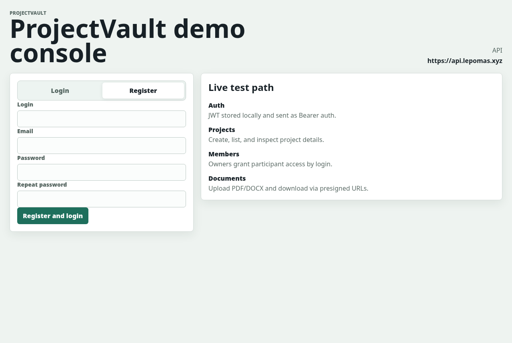
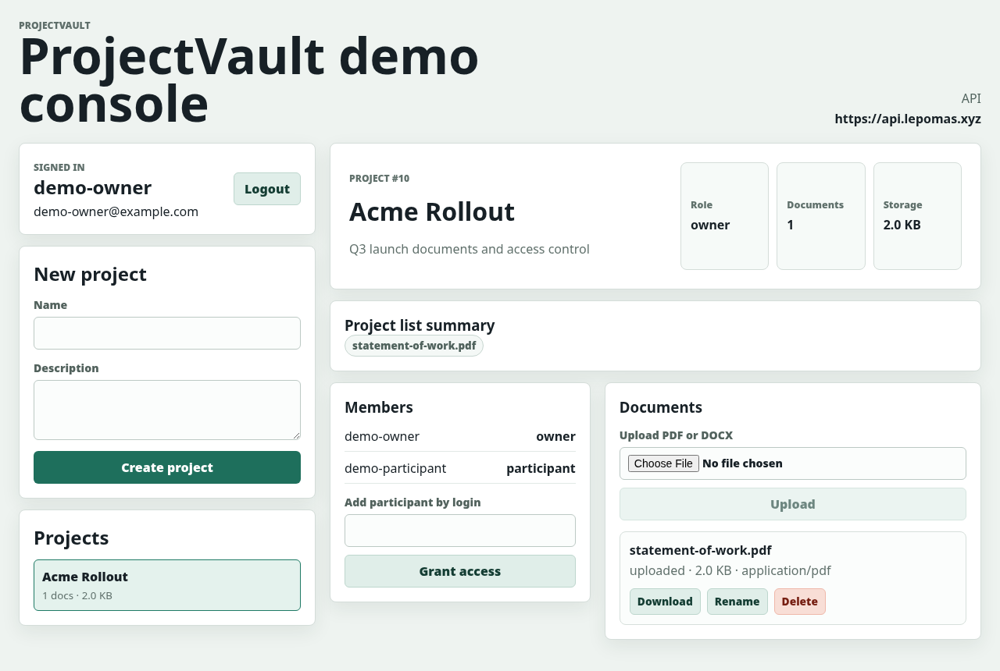
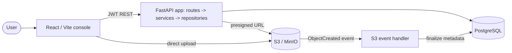

# ProjectVault API

> Secure, multi-tenant document vault: JWT-authenticated project workspaces with role-based access and event-driven, presigned-URL document uploads. Built as the capstone of the EPAM Python specialization.


ProjectVault lets owners create project workspaces, grant participants access by
login, and upload/download PDF and DOCX documents through presigned S3 URLs.
Uploads are finalized **event-driven**: the client presigns, uploads straight to
object storage, and an S3 `ObjectCreated` event triggers a handler that writes
the final document metadata to PostgreSQL — no large file ever passes through
the API process.

## Demo

A React/Vite console exercises the full auth → project → member → document flow
against the API.

| Auth & capabilities | Project workspace |
|---|---|
|  |  |

Run it yourself in two commands — see [Local development](#local-development).

## What this project demonstrates

- **AuthN/AuthZ** — JWT bearer auth (Argon2 password hashing), owner/participant
  **role-based permissions** enforced per project.
- **Event-driven uploads** — presign → direct-to-S3 upload → `ObjectCreated`
  event → handler finalizes metadata. Keeps the API stateless and large files
  off the request path.
- **Pluggable storage** — one storage adapter runs the same API on the local
  filesystem or any S3-compatible backend (MinIO locally, AWS S3 in the cloud).
- **Clean layering** — routes → services → repositories → SQLAlchemy models,
  with Pydantic v2 schemas at the edges.
- **Test pyramid** — `unit` / `integration` / `e2e` pytest markers, enforced
  one-per-test; Vitest + Playwright on the frontend.
- **CI/CD** — GitHub Actions runs lint, format check, tests, and
  `docker compose config` on every push; separate CD workflows build/push
  images and deploy.
- **Two deployment targets** — AWS (ECS for the API, container-image Lambda for
  the event handler, S3 + CloudFront for the frontend) and a self-hosted Docker
  Compose stack fronted by Caddy behind a Cloudflare Tunnel.
- **Infrastructure as code** — Terraform for the AWS document-processing Lambda
  path.

## Architecture



Document upload is **two-phase and event-driven**: `presign-upload` returns a
signed URL, the client `PUT`s the file straight to object storage, and the
`ObjectCreated` event drives the handler
(`app.lambda_handlers.s3_events`) that writes final metadata to PostgreSQL.
`complete-upload` exists as a synchronous fallback.

## Roadmap

- Forward database migrations beyond the Alembic baseline.
- Broaden Terraform coverage from the Lambda path to the full AWS environment.

## Local development

### 1. Copy environment file

```bash
cp .env.example .env
```

### 2. Start services

```bash
docker compose up --build
```

### 3. Health check

```bash
curl http://localhost:8000/health
```

Expected response:

```json
{
  "status": "ok",
  "service": "projectvault-api"
}
```

### 4. API docs

Open:

```text
http://localhost:8000/docs
```

By default, uploaded documents are stored on the local filesystem under
`DOCUMENT_STORAGE_PATH`, which defaults to `storage/documents`.

Each project has a configurable storage limit through
`PROJECT_STORAGE_LIMIT_BYTES`, defaulting to `104857600` bytes.

The API also includes an S3-compatible document flow for local MinIO:

- `POST /projects/{project_id}/documents/presign-upload`
- `POST /projects/{project_id}/documents/complete-upload`
- `GET /documents/{document_id}/download-url`

To use that flow against local MinIO, set this in `.env` before starting Docker
Compose:

```env
DOCUMENT_STORAGE_BACKEND=s3
```

Docker Compose starts MinIO on `http://localhost:9000` and the MinIO console on
`http://localhost:9001`. The bucket-init container creates the configured
`S3_BUCKET` automatically. The API uses `S3_ENDPOINT_URL` inside Docker and
rewrites presigned URLs to `S3_PUBLIC_ENDPOINT_URL` for host-side clients.

Validate the local event-driven flow with:

```bash
./scripts/s3-event-smoke-test.sh
```

This script uploads to MinIO through a presigned URL, simulates an
S3-compatible object-created event, runs the event handler inside the API
container, and verifies that metadata is finalized without calling
`complete-upload`.

The event handler lives at `app.lambda_handlers.s3_events.handler`. It imports
the app code, reads object metadata through the S3 storage adapter, and updates
PostgreSQL directly. `Dockerfile.lambda` packages this handler for AWS Lambda
container-image deployment through the CD workflow. The workflow updates an
existing Lambda function; it does not create the function or S3 event
notification.

### 5. Frontend demo app

The frontend lives under `frontend/` and is intentionally separate from the API
runtime. It defaults to the API base `https://api.lepomas.xyz`; for local work,
point it at `http://localhost:8000` (see below).

```bash
cd frontend
npm install
npm test
npm run build
npm run test:e2e
npm run dev
```

`npm run test:e2e` is an opt-in local browser smoke. It starts the built Vite
preview server and mocks API responses in the browser; it is not wired into
GitHub Actions.

Open:

```text
http://localhost:3000
```

The API allows CORS from `http://localhost:3000` by default. To point
the frontend at a different API, set:

```env
VITE_PROJECTVAULT_API_BASE_URL=http://localhost:8000
```

The frontend targets the current singular business routes such as `POST
/project`, `GET /project/{project_id}/info`, `POST
/project/{project_id}/invite?user={login}`, and `GET
/document/{document_id}/download-url`.

### 6. Seed sample data

Populate the Docker Compose PostgreSQL database with reusable demo data:

```bash
./scripts/seed-sample-data.sh
```

The wrapper starts the local `db` and `api` services, then runs the Python seed
script inside the API container so the Docker-only database host `db` and the
mounted document storage path match the API runtime environment.

If you intentionally want to seed from your local shell instead, use:

```bash
.venv/bin/python scripts/seed-sample-data.py
```

In that local-shell mode, the script maps the Docker-only database host `db` to
`localhost`, matching the PostgreSQL port published by Docker Compose. Your user
must also be able to write to `storage/documents`.

The script is deterministic and can be rerun. It recreates only the sample
projects, sample memberships, and sample document files under the
`sample/projects/...` storage prefix.

Sample users all use the password `super-secret-123`:

```text
ana / ana@example.com
bob / bob@example.com
carla / carla@example.com
diego / diego@example.com
```

The script prints the current project and document IDs after each run.

## Testing

Tests are organized by pytest marker and directory:

- `tests/unit/`: pure helper and configuration checks.
- `tests/integration/`: in-process API, database, service, script, and handler
  tests.
- `tests/e2e/`: live Docker Compose smoke wrappers.

Every test must have exactly one of `unit`, `integration`, or `e2e`; collection
fails when a test is missing a level marker or has more than one.

```bash
.venv/bin/python -m pytest -m unit
.venv/bin/python -m pytest -m integration
.venv/bin/python -m pytest -m "unit or integration"
```

E2E tests wrap the local S3 smoke scripts and are skipped by default. They require
`PROJECTVAULT_RUN_E2E=1` and an already-running S3-backed Docker Compose stack:

```bash
PROJECTVAULT_RUN_E2E=1 .venv/bin/python -m pytest -m e2e
```

Current CI does not run e2e after push. To run e2e in GitHub Actions, add a
dedicated job that starts the S3-backed Docker Compose stack, waits for API and
MinIO readiness, sets `PROJECTVAULT_RUN_E2E=1`, runs `pytest -m e2e`, and tears
the stack down. The current e2e scripts target a local Compose stack, not the
deployed `https://api.lepomas.xyz` API.

## Database schema

Docker Compose initializes a fresh local PostgreSQL volume from
`db/init/001_initial_schema.sql`.

Alembic is configured with an initial baseline migration under
`alembic/versions/`. For a database that was already initialized from
`db/init/001_initial_schema.sql`, stamp the database to the initial revision
before using future migrations so Alembic does not try to replay the baseline
over existing tables.

Forward migrations after the initial baseline are not yet in place. Until the
next migration is added, keep ORM models, the bootstrap SQL, and the Alembic
baseline aligned when changing the schema.

## CI and deployment status

GitHub Actions CI is configured in `.github/workflows/ci.yml`. It installs the
Python dependencies, runs Ruff linting, Ruff format check, unit tests,
integration tests, and `docker compose config`. It also installs the frontend
dependencies, runs the Vitest suite, runs the TypeScript check, and builds the
Vite app.

Live e2e smoke tests are not part of PR CI.

Backend CD is defined in `.github/workflows/deploy.yml` for a precreated AWS
environment. When the required AWS resources and GitHub variables exist, it
builds and pushes the API image to ECR, deploys the API image to an existing ECS
service, builds and pushes the documents Lambda image, and updates an existing
Lambda function.

Frontend CD is defined in `.github/workflows/deploy-frontend.yml`. It runs on
frontend changes to `main` and manual dispatches, installs dependencies, runs
the frontend checks, builds the Vite app, uploads `frontend/dist` to the
frontend S3 bucket, and invalidates the CloudFront paths needed for the SPA
entrypoint and social preview assets.

The CD workflows do not provision infrastructure; they deploy into precreated
resources. The project has been deployed two ways: an AWS environment (ECR
images, an ECS service for the API, an image-based documents Lambda wired to an
S3 `ObjectCreated` notification, RDS PostgreSQL, Secrets Manager for the JWT and
`DATABASE_URL` secrets, GitHub OIDC trust, and static S3 + CloudFront for the
frontend), and a self-hosted Docker Compose stack fronted by Caddy behind a
Cloudflare Tunnel (see `docs/DEPLOYMENT.md`). No public demo endpoint is
exposed at the moment. Forward migrations after the Alembic baseline and broader
Terraform coverage remain future work.

## Project structure

```text
app/
  api/              API routes
  core/             Settings and core config
  db/               Database connection setup
  models/           SQLAlchemy models
  schemas/          Pydantic schemas
  services/         Business logic
  repositories/     Database access logic
alembic/
  versions/         Alembic migration scripts
db/
  init/             PostgreSQL bootstrap SQL
tests/              Automated tests
docs/               Technical documentation
frontend/           React/Vite controlled demo app
```

## Setup status

* [x] Repository created
* [x] Project structure created
* [x] FastAPI configured
* [x] Docker Compose configured
* [x] PostgreSQL configured
* [x] `/health` endpoint available
* [x] Initial ERD documented
* [x] API conventions documented
